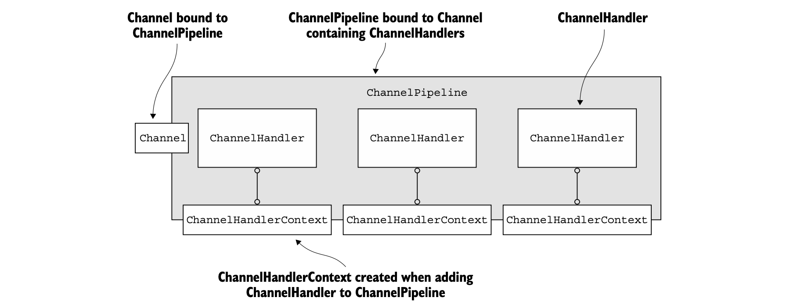

# This repo is dedicated to learning Netty framework by "Netty in Action" book.

## Main Netty's building blocks

- **Channels**: Represent open connection to socket. It's just like a vehicle for incoming and outgoing data.

- **Events and handlers**: Netty uses events to inform out business logic about  
    some action happened: a connection was established, a new inbound message has come, a connection was closed etc.  
    To react to this events Netty provide the mechanism to register callbacks using `interface ChannelHalder` abstraction.  
    There are different types of events, hence different types of `ChannelHandler`s  
  
- **Futures** `ChannelFuture`: Represent future result of an operation
  - You can register multiple listeners: `ChannelFutureListener` to invoke some logic when future result is ready


### Event Loop and Event Loop Group

- `EventLoop` is a Netty's abstraction for handling events that occur during a connection lifetime.  
- `EventLoopGroup` consists of one or several `EventLoop`s.
- Each `EventLoop` is bound to a one single `Thread`.
- All I/O events processed by `EventLoop` are handled on its dedicated `Thread`.
- A `Channel` is registered for its lifetime with a single `EventLoop`
- One `EventLoop` may be assigned to one or more `Channel`


### Channel Handlers and Channel Pipeline

- `ChannelHandler` is the container where your application business logic will reside.  
- `ChannelHandler` is triggered by network events (here word "event" is used very broadly -  
it can mean inbound or outbound data, connection establishment or closing connection...).
- `ChannelHandler`s must be registered for each new connection in order to react to events arising  
at this connection.
- `ChannelPipeline` provides a container for a chain of `ChannelHandlers`
- each `Channel` is assigned its own `ChannelPipeline`
- When event arises it flows through each `ChannelHandler`. The order in which they are executed
is determined by the order in which they were added.
- You can divide `ChannelHandler`s to two specific types:
  - `ChannelInboundHandler`
  - `ChannelOutboutHandler`

```plantuml
skinparam groupInheritance 2
skinparam linetype ortho

interface ChannelHandler
interface ChannelInboundHandler
interface ChannelOutboundHandler

ChannelInboundHandler -up-|> ChannelHandler
ChannelOutboundHandler -up-|> ChannelHandler
```

- From a client's point of view an **even is outbound** - if it moves from client to a server,
and **event is inbound** - if it moves from a server to the client.

An event can be forwarded to the next handler in the current chain  
by using the `ChannelHandlerContext` that’s supplied as an argument to each method.  
Because you’ll sometimes ignore uninteresting events, Netty provides
the abstract base classes `ChannelInboundHandlerAdapter` and `ChannelOutboundHandlerAdapter`.  
Each provides method implementations that simply pass the event to the next handler
by calling the corresponding method on the `ChannelHandlerContext`.  
You can then extend the class by overriding the methods that interest you.

### Sending messages

There are two ways of sending messages in Netty:
- write directly to the `Channel` - the message to start from the tail of the `ChannelPipeline`
- write to a ChannelHandlerContext object -  the message to start from the _next_ handler in the `ChannelPipeline` 


### Adapters

Netty provides default implementations of `ChannelHandler`, called adapters, where all methods have implemented
with default behaviour.  
These are the adapters you’ll call most often when creating your custom handlers:
- `ChannelHandlerAdapter`
- `ChannelInboundHandlerAdapter`
- `ChannelOutboundHandlerAdapter`
- `ChannelDuplexHandlerAdapter`

### Encoders and Decoders

They are simply other types of `ChannelHandler`.  
Encoders convert a message from an application convenient format to bytes.  
Decoders do reverse job.  

Given this, encoders implement `ChannelOutboundAdapter`,  
and decoders implement `ChannelInboundAdapter`.

There are different types of encoders and decoders implemented in Netty.  
If you need custom encoders/decoders, there are corresponding base classes:  
`MessageToByteEncoder<T>` and `ByteToMessageDecoder`;

### SimpleChannelInboundHandler<T>

Most frequently your application will employ a handler that receives a decoded message  
and applies business logic to the data. To create such a `ChannelHandler`,  
you need only extend the base class `SimpleChannelInboundHandler<T>`,  
where T is the Java type of the message you want to process.  

In this handler you’ll override one or more methods of the base class  
and obtain a reference to the `ChannelHandlerContext`,
which is passed as an input argument to all the handler methods.  

The most important method in a handler of this type is `channelRead0(ChannelHandlerContext,T)`.  
The implementation is entirely up to you, except for the __requirement that the current I/O thread not be blocked__.  

### Bootstrapping

Bootstrap classes provide containers for configuring network layer, which involves:
 - binding to a specific port: `ServerBootstrap` (server side)
 - connecting to a specific `host:port`: `Bootstrap` (client side)

 - `Bootstrap` (client) requires only one `EventLoopGroup`,
 - `ServerBootstrap` - two `EventLoopGroup`s

A server needs two distinct sets of channels:
 - First set will contain a single `ServerChannel`, bound to a local port
 - Second set will contain new `Channel`s, representing new incoming connections


## Channel Lifecycle

Channel has for states:
- **ChannelUnregistered**  
  The Channel was created, but isn’t registered to an EventLoop

- **ChannelRegistered**  
  The Channel is registered to an EventLoop

- **ChannelActive**  
  The Channel is active (connected to its remote peer).
  It’s now possible to receive and send data.

- **ChannelInactive**  
  The Channel isn’t connected to the remote peer

Normal lifecycle goes in the following order:  
 unregistered -> registered -> active -> inactive

As these state changes occur, corresponding events are forwarded  
to registered `ChannelHandler`s

### ChannelInboundHandler events

When a ChannelInboundHandler implementation overrides `channelRead()`,  
it is responsible for explicitly releasing the memory associated with pooled ByteBuf instances.

```java

@Sharable
public class DiscardHandler extends ChannelInboundHandlerAdapter {
    @Override
    public void channelRead(ChannelHandlerContext ctx, Object msg) {
        ReferenceCountUtil.release(msg);
    }
}
```

Netty logs unreleased resources with a WARN-level log message.  
But managing resources in this way can be cumbersome.  
A simpler alternative is to use SimpleChannelInboundHandler,  
because SimpleChannelInboundHandler releases resources automatically.

```java
@Sharable
public class SimpleDiscardHandler extends SimpleChannelInboundHandler<Object> {
    @Override
    public void channelRead0(ChannelHandlerContext ctx, Object msg) {
        // No need to do anything special
    }
}
```

### ChannelOutboundHandler events

A powerful capability of `ChannelOutboundHandler` is ___to defer an operation or event on demand___,  
which allows for sophisticated approaches to request handling. If writing to the remote peer is suspended,  
for example, you can defer flush operations and resume them later.  

### Resource management

Netty uses reference counting to handle pooled `ByteBufs`.  
So it’s important to adjust the reference count after you have finished using a `ByteBuf`.

To assist you in diagnosing potential problems, Netty provides class `ResourceLeakDetector`,  
which will sample about 1% of your application’s buffer allocations to check for memory leaks.  
The overhead involved is very small.

#### Leak Detection Levels

- **DISABLED**: Disables leak detection. Use this only after extensive testing.
- **SIMPLE**: Reports any leaks found using the default sampling rate of 1%. This is the default level and is a good fit for most cases.
- **ADVANCED**: Reports leaks found and where the message was accessed. Uses the default sampling rate.
- **PARANOID**: Like ADVANCED except that every access is sampled. This has a heavy impact on performance and should be used only in the debugging phase.

The leak-detection level is defined by setting the following Java system property:  
`java -Dio.netty.leakDetectionLevel=ADVANCED`

### Channel Pipeline

Normally each `ChannelHandler` in the `ChannelPipeline` processes events that are passed to it by its EventLoop (the I/O thread).  
It’s critically important not to block this thread as it would have a negative effect on the overall handling of I/O.  

Sometimes it may be necessary to interface with legacy code that uses blocking APIs.  
For this case, the ChannelPipeline has `add()` methods that accept an `EventExecutorGroup`.  
If an event is passed to a custom `EventExecutorGroup`, it will be handled by one of the `EventExecutor`s
contained in this EventExecutorGroup and thus be removed from the EventLoop of the `Channel` itself.   
For this use case Netty provides an implementation called `DefaultEventExecutorGroup`.  

```java
ServerBootstrap bootstrap = new ServerBootstrap();
b.childHandler(new ChannelInitializer<SocketChannel>() {
    @Override
    protected void initChannel(SocketChannel ch) {
        ch.pipeline().addLast(new DefaultEventExecutorGroup(1), new EchoServerHandler());
    }
});
```

### ChannelHandlerContext

`ChannelHandlerContext` represents the relation between a `ChannelHandler` and a `ChannelPipeline` where the handler was registered.  

`ChannelHandlerContext` contains some methods which are the same as in `ChannelHandler` and `ChannelPipeline`.  
The difference is, that when you invoke these methods on `ChannelHandler` or `ChannelPipeline`, they propagate  
through the entire pipeline.
The same methods on `ChannelHandlerContext` will start at the current associated `ChannelHandler`  
and propagate only to the next `ChannelHandler`.

**!NOTE!:** The `ChannelHandlerContext` associated with a `ChannelHandler` never changes,  
so it’s safe to cache a reference to it.



## Event Loop


